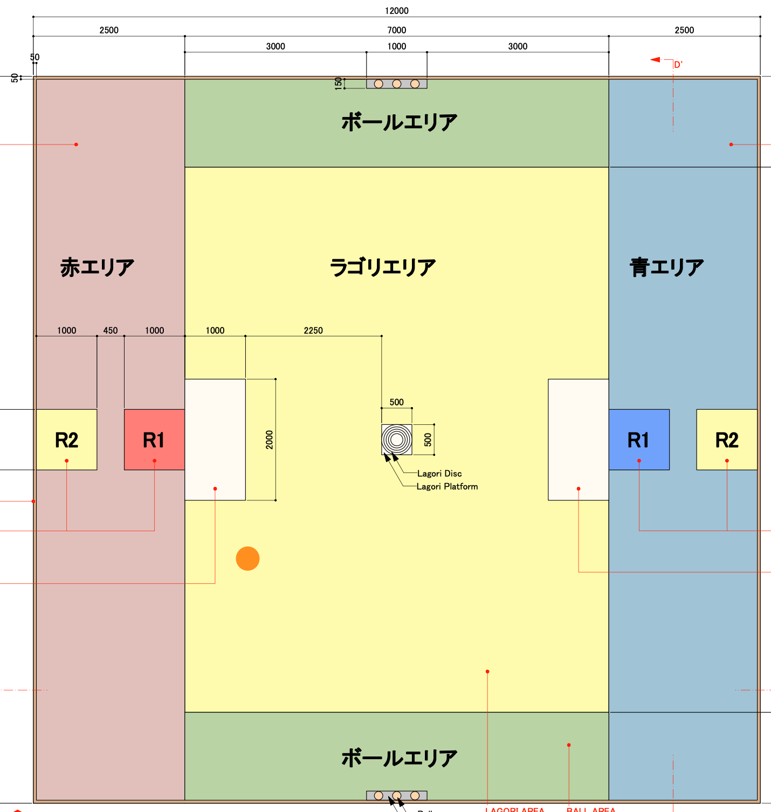
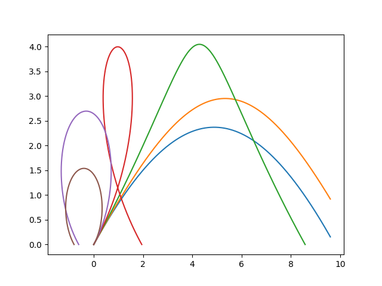

# Orbit-Analyzer
# アドベントカレンダー12/12 決勝で速度制限違反はあったのか？
このレポジトリは、学ロボ2022アドベントカレンダー12/12の記事として製作されました。\
書いた通り、今回のテーマは多くの大学を困惑させた速度制限が、果たして当日、特に炎上していた決勝で起こっていたのか検証します。
## 速度制限とは？炎上って？
ルールや経緯を知らない方のために、今年のRC(学生ロボコン(RoboCon)の略)で何があったのかを軽く説明します。

2022年のRCのテーマは「ラゴリ」というインドのスポーツで、5つのオブジェクトを積み上げるのが先か、それを妨害できるかというやりとりが肝でした。\
この妨害方法が、「相手の頭の上に乗せたボール(BH)を、別のボールを射出して落とす」となっており、多くのロボコニストが「これ、クッソ速い球投げるのが最適だよな...？」と、高速な射出の開発に躍起になっていたことと思われます。

そんな状況を察したのか、NHKが2月のルール改正で「ボールの射出制限は30km/h以下とする。このままだとまともにラゴリブレークできないので、ラゴリの下に塩ビシートをつけて、滑りやすくする」とし、多くの大学がこの大幅改正に手間取りました。

そんなこんなで迎えた決勝戦、金沢工業大学がラゴリを積む前に豊橋の妨害が成功し、金沢工業大学は大ピンチに陥ります。金沢工業大学が勝つためには、豊橋がラゴリを積む前にBHを落とさなければいけません。\
そしてRound2、豊橋のラゴリパイル...なのですが、何と豊橋はラゴリエリアに入ろうとしません。得点が並んだ場合、「相手のBHを落として、自分のBHは落とされなかった」チームの勝利となります。\
それに気がついた金沢工業大学、すかさずスタートゾーンの豊橋に向かってボールを射出します。しかし、豊橋に全てかわされ、豊橋の優勝という形で幕を下ろしました。

しかしこの後、「金沢工業大学のマシンがあそこからスタートゾーンを狙えるのは、速度制限違反じゃね？」という意見が噴出し、プチ炎上します。「それをいうなら豊橋もじゃん」という意見も出て、豊橋が公式で釈明を行うまでに拡大してしまいました。\
結局これは、工科大のロボコニストが「スピンをかけたら、速度制限内でも届くよ」と発言することで丸く収まりました。

## 検証
この一連の騒動を見ていた僕は思いました。

「本当にスピンをかければうまく行くのか？」

確かにスピンをかけたらマグヌス効果により上向の力が発生し、若干遠くに届きます。\
しかし、空気は非常に軽く、RC程度の規模では、ボールの軌道はよっぽど強い回転をかけない限り変化しないと考えました。

そこで、今回は、
- スピンをかけない場合、速度制限内で決勝の動きはできるのか
- スピンをかけた場合、速度制限内で決勝の動きはできるのか
    - 決勝の動きをするためには、どれくらいのスピンをかける必要があるのか
を調べていこうと思います。

前置きが長くなりましたが、ここからが本編です。\
今回は空気抵抗などのエネルギーロスを全て無視するので、おそらく求まった速度より若干速めに投げなくちゃいけないと思います。あらかじめご了承ください。
## スピンをかけない場合
スピンをかけない場合、単純な物理モデルを考えると、ボールの射出は質点の放物運動となり、軌道は初速度のみで決まります。\
x-y平面で、y軸下向きに重力が加わる場合において、原点から点(a, b)の上方を通る様にボールを投げるための、初速度の大きさ$v$, 角度$\theta$の条件を求めます。

上の様にパラメタが与えられた時、初期条件から

$$
x = (v\cos\theta) t\\
y = -\frac12gt^2 + (v\sin\theta) t
$$

となります。よって、 $x = a$ の時 $y \geq b$ となる場合、

$$
t = \frac{a}{v\cos\theta}\\
y = -\frac{g}{2}t^2 + (v\sin\theta)t
= -\frac{ga^2}{2v^2\cos^2\theta}+ a\tan\theta \geq b
$$

$v$ を固定した時の、最適な $\theta$ を求めます。

$$
\frac{1}{\cos^2\theta} = 1 + \tan^2\theta
$$

から、

$$
-\frac{ga^2}{2v^2}\frac{1}{\cos^2\theta} + a\tan\theta
= -\frac{ga^2}{2v^2}(1 + \tan^2\theta) + a\tan\theta
$$

となります。 $\tan\theta$ は任意の実数値を取れるので、これが最大となる時 $\tan\theta = v^2/(ga)$ で、

$$
y = -\frac{ga^2}{2v^2}(1 + \frac{v^2}{ga}) + \frac{v^2}{g}
= \frac{v^2}{2g} - \frac{ga^2}{2v^2} \geq b
$$

$v \neq 0$ としてもよく、この時 $V = v^2$ とすると、 $V > 0$ より

$$
\frac{V}{2g} - \frac{ga^2}{2V} \geq b
\Leftrightarrow V^2 - g^2a^2 -2gbV \geq 0\\
\Leftrightarrow V \geq bg + g\sqrt{b^2 + a^2}
$$

よって、求める $v$ の条件は

$$
v \geq \sqrt{bg + g\sqrt{b^2 + a^2}}
$$

$a = 0, b > 0$ とすると $v \geq \sqrt{2gb}$ となることから、これで正しそうなことがわかります。

まずは金沢工業大学です。\
相手チームのR2スタートゾーンと自チームのR1スタートゾーンは正対していて、9.5mの距離があります。よって、上の式において $a = 9.5$ です。\
また、目測だと金沢工業大学の射出口の高さは500mm、今回は少し高めに見積もって 600mmとしておきましょう。ルールで規定されている「プレートの高さ」は最低1200mmで、ここにパイプの高さ100mmが加わるので、メートル換算で $b = (1.2 + 0.1) - 0.6 = 0.7$ です。\
以上から、重力加速度を $9.8$ とすると、金沢工業大学の射出に必要な最低速度は、

$$
v = \sqrt{9.8 \cdot (0.7 + \sqrt{0.7^2 + 9.5^2})} = 10.01 \text{m/s} = 36\text{km/h}
$$

明らかに速度制限を超過していることがわかります。\
空気抵抗を考慮すると、言い逃れできないレベルで違反しているのではないでしょうか。

続いて豊橋技術科学大学です。\
今回は、決勝で金沢工業大学のBHを落とした[このシーン](https://youtu.be/juYlfcXIgFk?t=16241)で検証します。\
フィールドのペナルティゾーン(白い部分)との位置関係を考えると、ボールの到達地点は下画像のオレンジの丸を置いたところになりそうです。

よって、大体 $a = \sqrt{2.0^2 + (7.0 - 1.0 + 0.5)^2}$ とできそうです。\
一方、豊橋の射出機構は、比較的高い位置から打っています。ロボット上部のLiDARでパイプを見ていると考えると、多めに見積もって $b = 0.2$ 程度とすると良さそうです。\
これらをまとめると、豊橋の射出に必要な速度は

$$
v = \sqrt{9.8 \cdot (0.2 + \sqrt{0.2^2 + 2.0^2 + 6.5^2})} = 8.2846 \text{m/s} = 29.82\text{km/h}
$$

こちらは、ギリギリ制限に収まっていることがわかります。\
空気抵抗を考慮すると制限を超えそうですが、今回の計測では、速度計の誤差を考慮して、33km/h以下の計測結果であれば大丈夫とのことでした。\
空気抵抗を考慮しても、豊橋の射出は計測をパスできるのではないでしょうか。
### スピンをかけない場合まとめ
スピンがない場合、
- 理想的な条件を考えても、金沢工業大学は明らかにルール違反をしている
- 豊橋技術科学大学は、30km/hは超えているかもしれないが、計測はパスしていそう
## スピンをかける場合
では次に、スピンをかける場合を考えましょう。\
豊橋は先ほどの計算で無罪っぽいことがわかったので、金沢工業大学の投擲のみにここでは注目します。

スピンをかけた場合、その回転速度に応じて揚力が発生します。\
[この資料](miyazaki-catv.ne.jp/~kiku2816/EXERCISE/Magnus_effect.pdf)に基づき、ボールを高さ $2R$ , 半径 $R$ の円柱と近似すると、理論的には $\rho v 4\pi R^3 \omega$ の力が、速度に垂直に加わりそうです。

よって、運動方程式を記述すると

$$
m\dot{v_x} = -4\pi\rho R^3 \omega v_y 
\Leftrightarrow \dot{v_x} = -\frac{4\pi\rho R^3\omega}{m}v_y\\
m\dot{v_y} = 4\pi\rho R^3 \omega v_x - mg
\Leftrightarrow \dot{v_y} = \frac{4\pi\rho R^3\omega}{m} v_x - g
$$

$v = 33\text{km/s}, \theta = \tan^{-1}(v^2/(ga))$ とした上で、 $\omega$ を適当に変化させると、結果はこんな感じになりました。

plotのpythonスクリプトはcodeディレクトリのplot_spin.pyに書かれています。 $\omega$ の値に適当な値を与えると軌道が得られると思うので、お手元でも是非確認してみてください。\
これを見ると、1秒に1回転(青線)だと若干足りず、1秒に2回転(黄線)だといい感じに飛びそうなことがわかります。

ただし、これはあくまでも超理想的な条件を考えた場合です。\
上にあげた資料にある通り、実際に実験してみると、理論値よりも揚力は遥かに小さくなるみたいです。\
また、円柱は半径が全て一応ですが、球は端に行くにつれて半径が小さくなります。このことを考慮すると、理論的な揚力の大きさは若干小さくなりそうです。\
さらに、実際には揚力に加えて、動きを妨げる方向に抗力が加わったり、空気抵抗が加わったりします。\
以上を考慮すると、9.5m飛ばすためには、もっと高速なスピンが必要になる...かもしれないです。僕は流体力学にあんまり詳しくないので、誰か数式を教えてください。軌道のシミュレータは書きます。
## スピンをかけた場合のまとめ
- 金沢工業大学は、決勝で縦向きに1秒に2回転程度の速度の回転を与えていたら、ルール違反にはならない...かもしれない
## おまけ 「そもそも...」
豊橋の無実は説明できて、ある程度の速さのスピンをかけたら金沢工業大学も無実かもしれないという結論が出ました。\
しかし、**そもそも金沢工業大学は、スピンをかけられる投擲機構だったでしょうか?**\
[このあたり](https://youtu.be/juYlfcXIgFk?t=8312)とかをみるとわかりやすいですが、金沢工業大学の投擲機構は、ボールを左右のローラーで挟んで投げる形をとっています。\
上下に何かついている様に見えますが、聞いたところこれはそろばんで、ボールに縦方向のスピンを与えられるようなアクチュエータではないようです。\
以上から、金沢工業大学はボールに縦方向のスピンを与えられる様な機構は持っていないことがわかります。となると、ルール違反をしている可能性が非常に高いですね。\
また、**そもそもあの速度計はスピンも読み取ります。**\
まだ速度計を持っているロボコニストの方々は、是非試してみてください。適当なモーターに独ステとかのタイヤを繋いで、ぶん回してるのを速度計で読むと、40km/hとか出てくるのではないでしょうか。\
[取扱説明書](https://www.esco-net.com/wcs/escort/ItemFile/EA7/EA714/EA714A-2/EA714A-2_MNL_JPN_MAK_OUT(01).pdf)によると、今回使った速度計は「最高速度」を読み取るため、正確な実験はできていないですが、スピンを加味した速度を計測する可能性が高いです。少なくとも、スピンを加えたら同じ計測結果なのに飛距離が段違い...なんてことは起こらないと思いました。\
工科大の方のツイートも、もしかしたら何かの勘違いかもしれないですね。
## おしまい
いかがでしたか？\
あくまで理論上の議論でしたが、おそらく豊橋は制限ギリギリで、金沢工業大学大学はおそらく制限オーバーという結論になりました。\
まあ元はと言えばいきなりクッソ遅い制限速度を出したNHKが悪いとも言えるかもしれませんね。今後は制限速度を理論的に計算するか、速度制限を指摘できる様な環境が整ってくれるといいですね！\
来年は全員ルールを守り、正々堂々と戦う様にしましょう。
